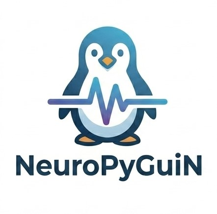
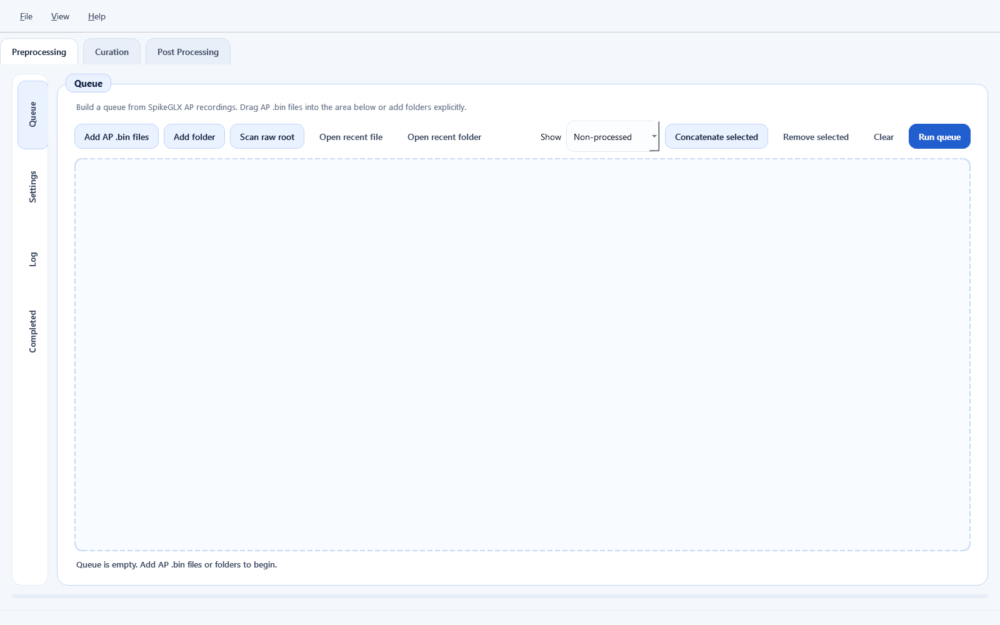
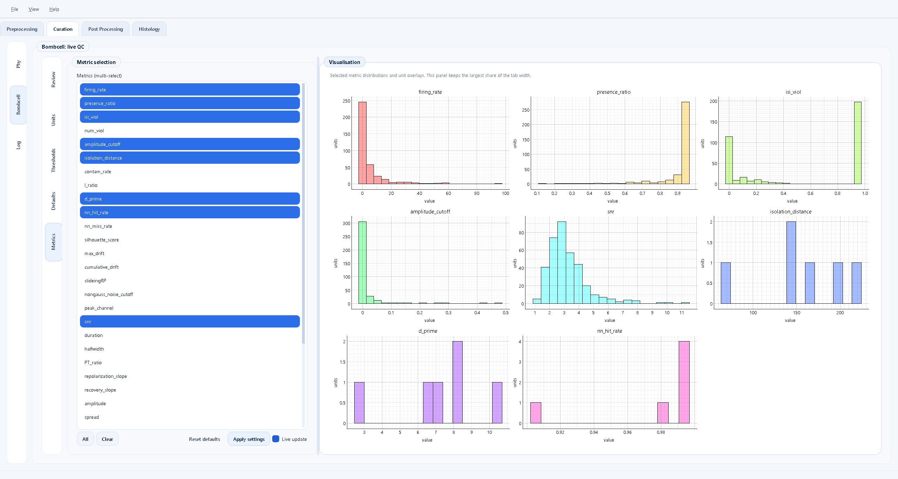
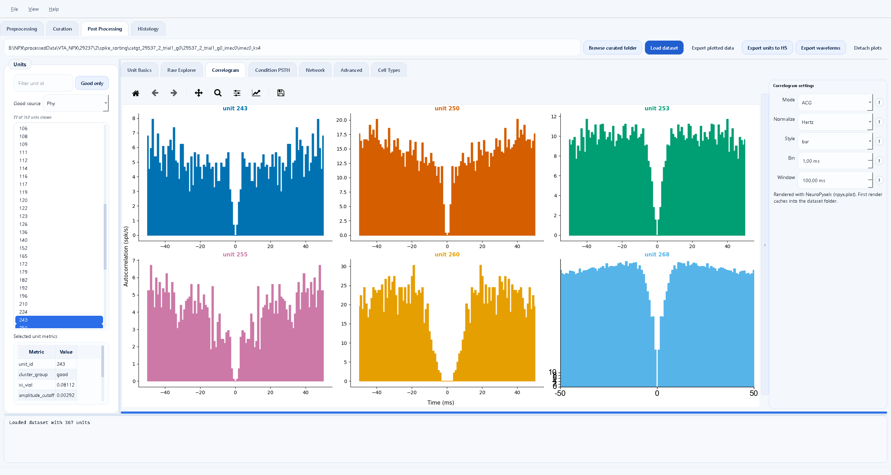
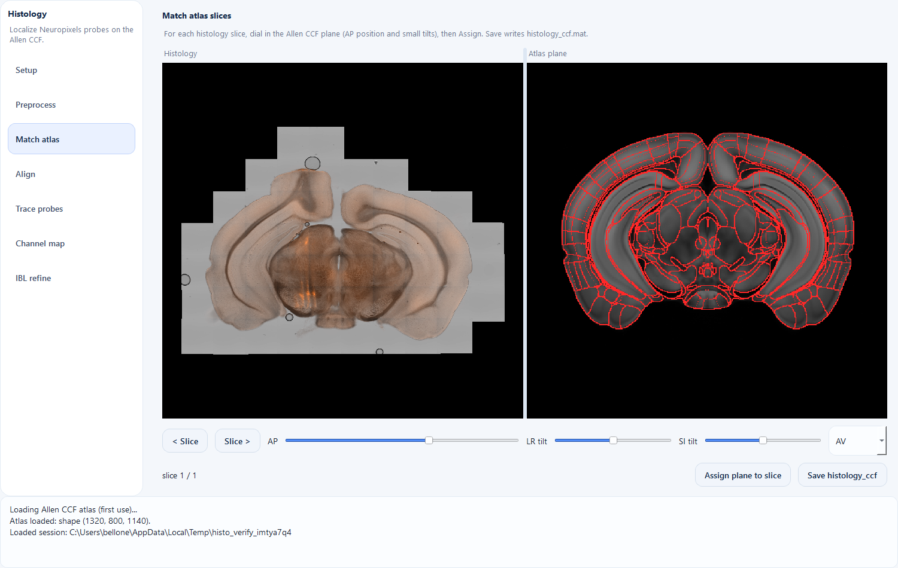
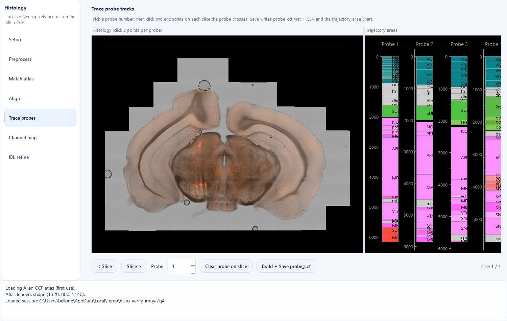
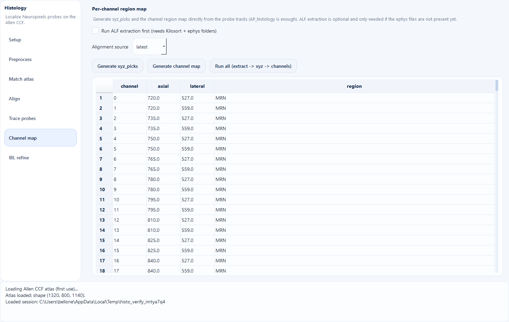
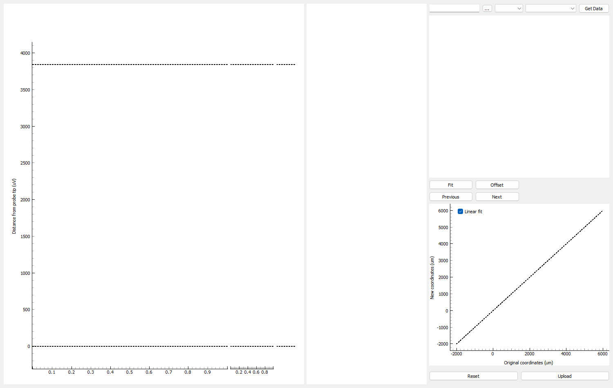
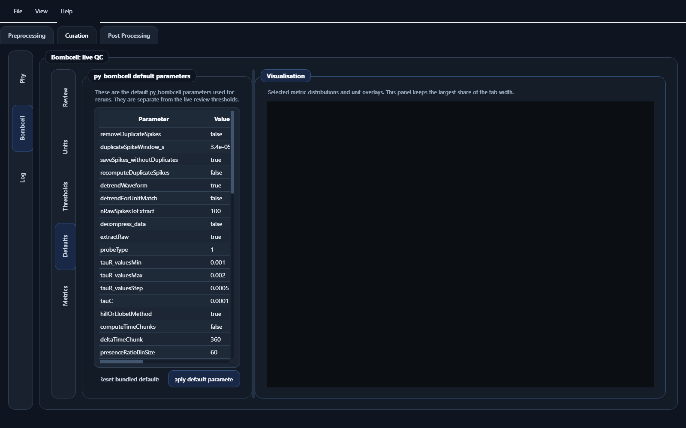

<div align="center">



# NeuroPyGuiN

### Your Neuropixels pipeline, minus the terminal gymnastics.


*From raw `.bin` to "this neuron lives in the VTA", without typing a single flag.*

</div>

---

Neuropixels data is glorious. It is also a small mountain of binary files, config
flags, command-line tools, and "wait, which script do I run again?". NeuroPyGuiN
puts the whole journey behind a clean, clickable desktop app: drop in your
recordings, press buttons, watch progress bars, and end up with sorted, curated,
quality-checked, plotted, and **brain-localized** units. No raw flag-typing required.

It is one window with four friendly tabs that follow the natural flow of a
project:

> ### Preprocess and sort  ➜  Curate  ➜  Explore  ➜  Localize

## ✨ Take the tour

### 1. Preprocessing: build a queue, press go

Drag your SpikeGLX `.bin` files in (or scan a folder), pick your steps, and let
the queue run CatGT, Kilosort4, quality metrics, and friends while you get a
coffee. Recorded the same neurons across several sessions? Select them, hit
**Concatenate selected**, and sort them together so units keep the same identity
across days.



### 2. Curation: judge your units, fast

Launch phy for manual curation, or let **Bombcell** do the heavy lifting:
tune thresholds with a live preview of how many units pass, eyeball the metric
histograms, and label good / noise / MUA in a couple of clicks. Sorted a
concatenated recording? One button splits the result back into per-session
spike trains, with each session's events attached.



### 3. Post Processing: see your neurons do their thing

Load a curated dataset and the plots build themselves: rasters, firing rates,
mean waveforms, autocorrelograms, ISI histograms, condition PSTHs, and network
views. Filter to good units only, then export everything to a tidy HDF5 file.



### 4. Histology: put every channel on the map 🧠

The newest tab answers the question every Neuropixels paper needs: *where was the
probe?* It reimplements the
[AP_histology](https://github.com/petersaj/AP_histology) workflow natively in
Python (no MATLAB), wraps it in a renewed, unified GUI, and can optionally hand
off to the [IBL](https://github.com/int-brain-lab/iblapps) ephys-alignment GUI for
electrophysiology-guided refinement. Walk it left to right and you go from a
slide scan to a per-channel brain-region map.

## 🧠 Find your neurons in the brain

A seven-stage rail walks you through localization, each step writing the same
files the original tools use, so everything stays interoperable.

**Match each slice to the Allen CCF.** Dial in the coronal plane with an AP slider
plus gentle tilts, flip between template, annotation, and overlay views, and the
matched atlas plane appears next to your histology.



**Trace the probe, read the regions.** Click the two ends of each shank on every
slice it crosses. NeuroPyGuiN lifts the track into CCF space, fits the trajectory,
and paints the regions it passes through, depth by depth, just like the classic
AP_histology figure.



**Get the per-channel map.** One click turns the traced tracks into
`channel_locations_all_shanks.json`: every channel, its depth, and its brain
region. The AP_histology path alone is enough to produce this.



**Refine with electrophysiology (optional).** Prefer to nudge the alignment using
real ephys features? One button launches the unmodified IBL ephys-alignment GUI on
your session. Save there, regenerate the channel map, done.



Outputs along the way: `histology_ccf.mat`, `atlas2histology_tform.mat`,
`probe_ccf.mat` (+ friendly `.csv` versions), `xyz_picks_shankN.json`, and the
final `channel_locations_all_shanks.json`. The MAT/JSON files are byte-compatible
with the original toolchain.

### Prefer the dark side? 🌙

A single toggle flips the whole app (and every plot) between light and dark.



## Why you might like it

- **Zero terminal drama.** The whole pipeline is point-and-click, with live logs and progress so you always know what is happening.
- **Sort across sessions.** Fuse multiple recordings into one, sort them jointly, then split the spikes back per session. Same neuron, same ID, every day.
- **Curation that respects your time.** Bombcell metrics and labels, live threshold previews, and a one-click jump into phy.
- **Plots on tap.** Post-processing figures refresh automatically as you change settings. No "compute" button hunting.
- **Anatomy, finally easy.** AP_histology and IBL alignment, reimagined as one elegant tab, with the per-channel region map a click away.
- **Looks good doing it.** Light and dark themes across every view.

## 🚀 Get started in 3 steps

```powershell
# 1) Make the environment (one env runs the whole app, numpy pinned for Kilosort)
conda env create -f environment.yml
conda activate neuropygui

# 2) Install the app extras
pip install -r requirements.txt
pip install phy            # optional, for manual curation

# 3) Launch it
python main.py
```

That is it. `ecephys_spike_sorting` and `py_bombcell` are bundled inside the app
folder, so there is nothing else to clone.

> On NVIDIA machines, GPU filtering/whitening uses CuPy. With a CUDA 12 driver:
> `conda install -c conda-forge cupy cuda-version=12` (or `pip install cupy-cuda12x`).

### Light up the Histology tab

The atlas matching and tracing need the Allen Mouse Brain CCF 10um volumes.
Download them once from **https://osf.io/fv7ed/overview**, then point the
*Atlas folder* on the Histology > Setup page at that directory (or set
`NPG_ATLAS_PATH`). The channel map and the IBL GUI use the IBL stack; see
[`requirements-histology.txt`](./requirements-histology.txt) for the
Kilosort-friendly (numpy < 2) install.

### Bring your own tools

A few external programs do the actual sorting heavy-lifting and are installed
separately, then pointed to from the Preprocessing tab:
`CatGT`, `TPrime`, `C_Waves`, and `Kilosort4`.

<details>
<summary>Full dependency list</summary>

Core Python packages live in [`requirements.txt`](./requirements.txt): `PySide6`,
`pyqtgraph`, `numpy`, `pandas`, `scipy`, `matplotlib`, `tqdm`, `numba`,
`scikit-learn`, `imbalanced-learn`, `statsmodels`, `networkx`, `psutil`,
`joblib`, `h5py`, `seaborn`, `cachecache`, `upsetplot`, `pyarrow`, `ipython`,
`cmcrameri`, `pillow`. Histology extras live in
[`requirements-histology.txt`](./requirements-histology.txt): `tifffile`,
`opencv-python-headless`, and (for the channel map + IBL GUI) `ibllib`,
`iblatlas`, `SimpleITK`. The bundled `environment.yml` targets Python 3.10 and is
the recommended path for rebuilding or packaging the app.

</details>

## Good to know

- Preprocessing expects SpikeGLX-style AP files (`*.imecX.ap.bin`).
- Quality labels are read from `bombcell_labels.csv` first, then `cluster_group.tsv`.
- The Histology tab works without the IBL stack (AP_histology path is self-sufficient); the IBL GUI is optional refinement.
- `probe_ccf.mat` is read by the IBL prep scripts, and the generated `channel_locations_all_shanks.json` reproduces the IBL GUI output exactly.
- Settings, recents, and window layout are remembered between sessions.

## Standing on the shoulders of giants

NeuroPyGuiN is a friendly front-end. The real science is done by the tools
below. If you use this app in a publication, please cite the ones you used.

### ecephys_spike_sorting (Allen Institute)

The spike-sorting pipeline (CatGT, Kilosort, TPrime, quality metrics, etc.) is
built on `ecephys_spike_sorting`, developed by the Allen Institute for Brain
Science for the Allen Brain Observatory. Per the
[Allen Institute citation policy](https://alleninstitute.org/legal/citation-policy),
cite both the software and its primary publication:

- Allen Institute for Brain Science (2019). *ecephys_spike_sorting* [software]. Available from https://github.com/AllenInstitute/ecephys_spike_sorting
- Siegle, J. H., Jia, X., Durand, S., et al. (2021). Survey of spiking in the mouse visual system reveals functional hierarchy. *Nature*, 592, 86-92. https://doi.org/10.1038/s41586-020-03171-x

> © 2019 Allen Institute for Brain Science. Used under the Allen Institute Terms of Use.

The version bundled here is the SpikeGLX/CatGT/TPrime/Kilosort4 fork maintained
by Jennifer Colonell (https://github.com/jenniferColonell/ecephys_spike_sorting),
which adapts the Allen Institute pipeline; please acknowledge it as well.

### NeuroPyxels / npyx (M. Beau et al.)

Loading, processing, and plotting of Neuropixels data uses NeuroPyxels:

- Beau, M., D'Agostino, F., Lajko, A., Martínez, G., Häusser, M., & Kostadinov, D. (2021). *NeuroPyxels: loading, processing and plotting Neuropixels data in Python.* Zenodo. https://doi.org/10.5281/zenodo.5509733

Repository: https://github.com/m-beau/NeuroPyxels

### Bombcell (J. Fabre et al.)

Automated quality metrics and unit classification use Bombcell:

- Fabre, J. M. J., van Beest, E. H., Peters, A. J., Carandini, M., & Harris, K. D. (2023). *Bombcell: automated curation and cell classification of spike-sorted electrophysiology data.* Zenodo. https://doi.org/10.5281/zenodo.8172821

Repository: https://github.com/Julie-Fabre/bombcell

### AP_histology (P. Shamash, A. Peters et al.)

The Histology tab reimplements the AP_histology probe-localization workflow.
If you use it, please cite/acknowledge the original toolbox:

- Peters, A. J. *AP_histology* [software]. https://github.com/petersaj/AP_histology
- Shamash, P., Carandini, M., Harris, K., & Steinmetz, N. (2018). *A tool for analyzing electrode tracks from slice histology.* bioRxiv. https://doi.org/10.1101/447995

Atlas: Allen Mouse Brain Common Coordinate Framework (CCFv3),
Wang, Q., et al. (2020). *The Allen Mouse Brain Common Coordinate Framework.*
Cell, 181(4), 936-953. https://doi.org/10.1016/j.cell.2020.04.007

### IBL ephys-alignment GUI (International Brain Laboratory)

The optional refinement step launches the unmodified IBL ephys-alignment GUI, and
the channel-region map reuses IBL's `iblatlas` / `ibllib`:

- International Brain Laboratory. *iblapps / atlaselectrophysiology* [software]. https://github.com/int-brain-lab/iblapps
- International Brain Laboratory, et al. (2022). *Reproducibility of in vivo electrophysiological measurements in mice.* bioRxiv. https://doi.org/10.1101/2022.05.09.491042

---

<div align="center">

Made with care in the Bellone Lab for the Neuropixels community.

</div>
