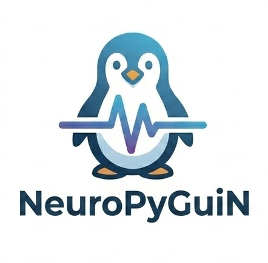
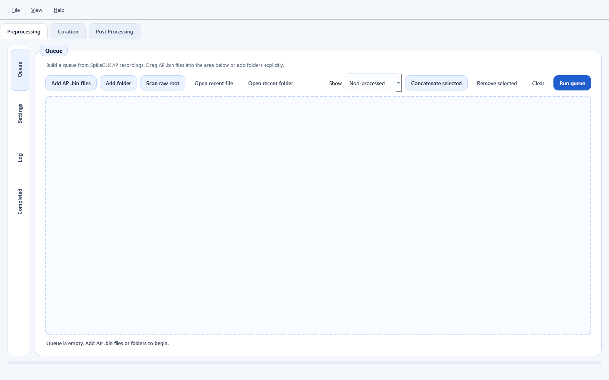
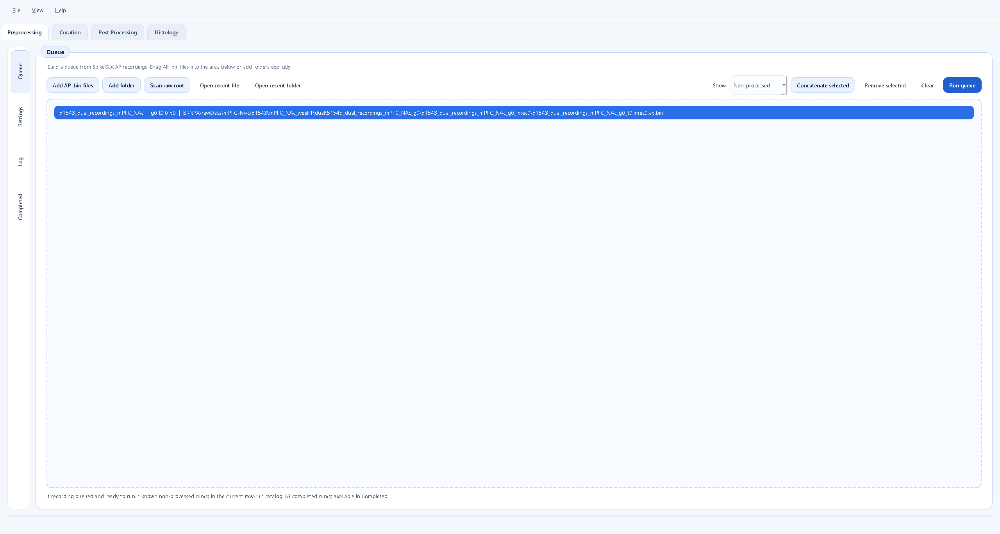
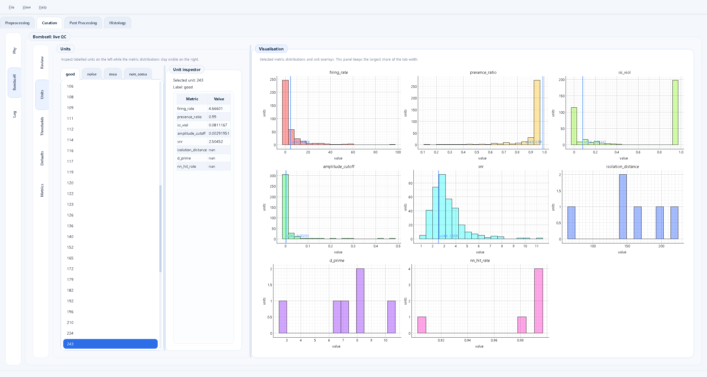
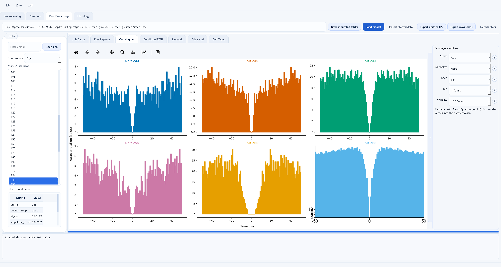
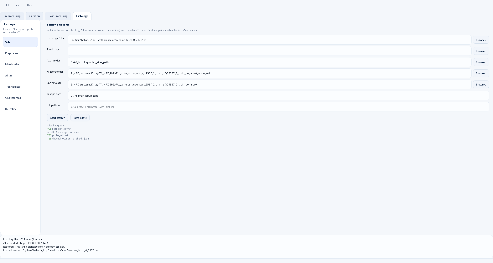
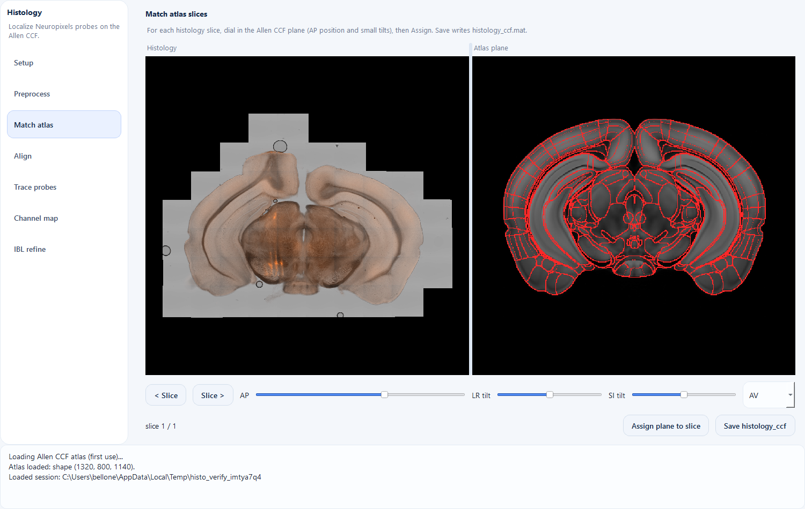
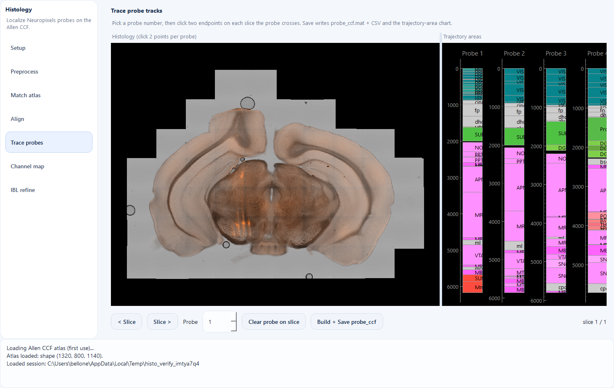
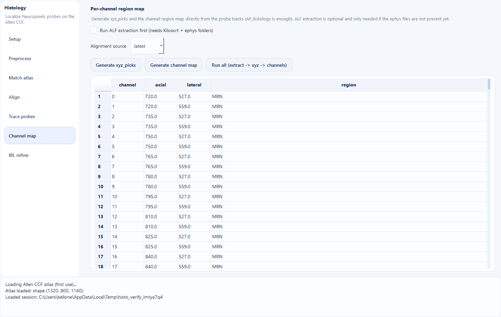
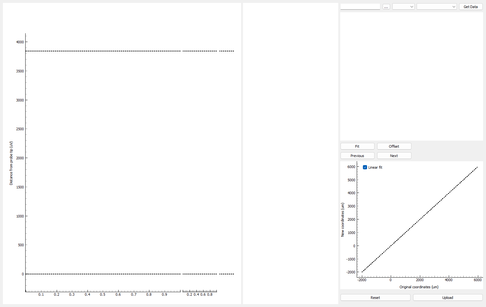

<div align="center">



# NeuroPyGuiN

### Your Neuropixels pipeline, minus the terminal gymnastics.


</div>

---

Neuropixels data is glorious. It is also a small mountain of binary files, config
flags, command-line tools, and "wait, which script do I run again?". NeuroPyGuiN
puts the whole journey behind a clean, clickable desktop app: drop in your
recordings, press buttons, watch progress bars, and end up with sorted, curated,
quality-checked, plotted, and **brain-localized** units. No raw flag-typing required.

It is one window with four friendly tabs that follow the natural flow of a
project:

> ### Preprocess and sort  ➜  Curate  ➜  Explore  ➜  Localize

## ✨ Take the tour

### 1. Preprocessing: build a queue, press go

Drag your SpikeGLX `.bin` files in (or scan a folder), pick your steps, and let
the queue run CatGT, Kilosort4, quality metrics, and friends while you get a
coffee. Recorded the same neurons across several sessions? Select them, hit
**Concatenate selected**, and sort them together so units keep the same identity
across days.







### 2. Curation: judge your units, fast

Launch phy for manual curation, or let **Bombcell** do the heavy lifting:
tune thresholds with a live preview of how many units pass, eyeball the metric
histograms, and label good / noise / MUA in a couple of clicks. Sorted a
concatenated recording? One button splits the result back into per-session
spike trains, with each session's events attached.




### 3. Post Processing: see your neurons do their thing

Load a curated dataset and the figures build themselves, in the clean
[NeuroPyxels](https://github.com/m-beau/NeuroPyxels) style. A prominent unit list
on the left, a collapsible settings panel on the right (one discrete arrow hides
it so the figures go full-width), and seven analyses:

- **Unit Basics** -  mean waveform, auto-correlogram, log-ISI with the violation %, plus amplitude and
  firing rate over the whole session.
- **Raw Explorer** - stacked, filtered multichannel traces around the unit's peak
  channel with its spikes overlaid (npyx `plot_raw_units` style).
- **Correlogram** - ACG/CCG grid.
- **Condition PSTH**.
- **Network** - correlation matrix, connection matrix.
- **Advanced** - a curated set oftools (3D ACG/CCG, Stark-Abeles monosynaptic significance, STTC, cross-ISI).
- **Cell Types** - automatic cell-type classification (see below).

Filter to good units only, **export all good-unit waveform+ACG cards to a single
PDF (and per-unit PNGs)** with one button, or export everything to a tidy HDF5.



### Cell-type classification (C4 and Bombcell)

The **Cell Types** panel runs automatic cell-type classifiers and writes the
results to a CSV plus a phy-compatible TSV (`cluster_*_cell_type.tsv`), with
NeuroPyxels-style figures:

- **C4** ([Beau et al.](https://github.com/m-beau/NeuroPyxels)) - a
  Laplace-calibrated CNN ensemble that predicts **cerebellar** cell types
  (GoC, MLI, MFB, PkC_ss, PkC_cs) from each unit's 3D autocorrelogram + waveform,
  with per-class probabilities and a confidence. It is *cerebellum-trained*, so on
  other regions the labels are indicative cell-type shapes rather than ground truth.
- **Bombcell** ([Fabre et al.](https://github.com/Julie-Fabre/bombcell)) -
  threshold-based, **region-specific** classification (cortex: wide- vs
  narrow-spiking; striatum: MSN / FSI / TAN / UIN) from waveform duration,
  post-spike suppression, proportion of long ISIs and firing rate, mirroring the
  MATLAB `classifyCells`.

**C4 runs in its own isolated environment.** C4's `laplace` dependency needs
`torch >= 2.6`, which is incompatible with the main app env's CUDA `torch 2.5.1`
(Kilosort). So, exactly like phy and the IBL GUI, C4 runs in a separate
`npyx_c4` conda env via subprocess and the main env is never touched. To set it up
once:

```bash
conda create -n npyx_c4 python=3.10 -y
conda run -n npyx_c4 python -m pip install "npyx[c4]"
# Two post-install pins are required:
conda run -n npyx_c4 python -m pip install "setuptools<80" "scikit-learn<1.6"
```

The pretrained ensemble (~2.7 GB) downloads to `~/.npyx_c4_resources` on first use.
Point the app at a non-default interpreter with the `NPYX_C4_PYTHON` environment
variable. Never `pip install laplace-torch` into the main app env: it can replace
the CUDA-enabled PyTorch build and break Kilosort. If that happens, rebuilding
the main environment from the appropriate platform file is the safest repair.

### 4. Histology: put every channel on the map 🧠

The newest tab answers the question every Neuropixels paper needs: *where was the
probe?* It reimplements the
[AP_histology](https://github.com/petersaj/AP_histology) workflow natively in
Python (no MATLAB), wraps it in a renewed, unified GUI, and can optionally hand
off to the [IBL](https://github.com/int-brain-lab/iblapps) ephys-alignment GUI for
electrophysiology-guided refinement. Walk it left to right and you go from a
slide scan to a per-channel brain-region map.

## 🧠 Find your neurons in the brain

A seven-stage rail walks you through localization, each step writing the same
files the original tools use, so everything stays interoperable.



**Match each slice to the Allen CCF.** Dial in the coronal plane with an AP slider
plus gentle tilts, flip between template, annotation, and overlay views, and the
matched atlas plane appears next to your histology.



**Trace the probe, read the regions.** Click the two ends of each shank on every
slice it crosses. NeuroPyGuiN lifts the track into CCF space, fits the trajectory,
and paints the regions it passes through, depth by depth, just like the classic
AP_histology figure.



**Get the per-channel map.** One click turns the traced tracks into
`channel_locations_all_shanks.json`: every channel, its depth, and its brain
region. The AP_histology path alone is enough to produce this.



**Refine with electrophysiology (optional).** Prefer to nudge the alignment using
real ephys features? One button launches the unmodified IBL ephys-alignment GUI on
your session. Save there, regenerate the channel map, done.



Outputs along the way: `histology_ccf.mat`, `atlas2histology_tform.mat`,
`probe_ccf.mat` (+ friendly `.csv` versions), `xyz_picks_shankN.json`, and the
final `channel_locations_all_shanks.json`. The MAT/JSON files are byte-compatible
with the original toolchain.

## Why you might like it

- **Zero terminal drama.** The whole pipeline is point-and-click, with live logs and progress so you always know what is happening.
- **Sort across sessions.** Fuse multiple recordings into one, sort them jointly, then split the spikes back per session. Same neuron, same ID, every day.
- **Curation that respects your time.** Bombcell metrics and labels, live threshold previews, and a one-click jump into phy.
- **Plots on tap.** Post-processing figures refresh automatically as you change settings. No "compute" button hunting.
- **Anatomy, finally easy.** AP_histology and IBL alignment, reimagined as one elegant tab, with the per-channel region map a click away.
- **Looks good doing it.** Light and dark themes across every view.

## 🚀 Installation

NeuroPyGuiN has a separate Conda environment file for each supported operating
system: [`environment-windows.yml`](./environment-windows.yml) and
[`environment-linux.yml`](./environment-linux.yml). Both install Python 3.10,
the GUI, Kilosort 4 with CUDA-enabled PyTorch, the scientific stack, phy, and the
histology dependencies. Use the file that matches the machine on which the app
will run. Do not use the Windows file from WSL or the Linux file from Windows.

### Windows 10 or 11

Requirements: 64-bit Windows, an NVIDIA GPU with a driver compatible with CUDA
12.6, and [Miniconda](https://docs.conda.io/projects/miniconda/en/latest/) or
Anaconda. Open **Anaconda Prompt**, change to the cloned repository, and run:

```powershell
conda env create -f environment-windows.yml
conda activate neuropyguin
python main.py
```

The Windows environment uses Windows builds of CatGT, TPrime, and C_Waves. Their
installer may also require the Microsoft Visual C++ Redistributable.

### Linux x86_64

Requirements: 64-bit Linux, an NVIDIA GPU with a driver compatible with CUDA
12.6, and Miniconda or Anaconda. The PySide6 GUI also needs the following system
libraries on Ubuntu or Debian:

```bash
sudo apt update
sudo apt install libxcb-cursor0 libxcb-icccm4 libxcb-keysyms1 \
  libxcb-shape0 libxcb-xinerama0 libxkbcommon-x11-0
```

Then create the Linux environment and launch the app:

```bash
git clone https://github.com/BelloneLab/NeuroPyGuiN.git
cd NeuroPyGuiN
conda env create -f environment-linux.yml
conda activate neuropyguin
python main.py
```

The Linux environment uses native Linux builds of CatGT, TPrime, and C_Waves.
WSL is not a tested or supported GUI configuration.

### Update or rebuild the environment

To update an existing installation while removing dependencies that are no
longer declared, use the matching file for your operating system:

```powershell
# Windows, in Anaconda Prompt
conda env update -n neuropyguin -f environment-windows.yml --prune
conda deactivate
conda activate neuropyguin
```

```bash
# Linux
conda env update -n neuropyguin -f environment-linux.yml --prune
conda deactivate
conda activate neuropyguin
```

For a clean rebuild, remove the environment and repeat the appropriate creation
command above:

```bash
conda deactivate
conda env remove -n neuropyguin
```

`ecephys_spike_sorting`, `py_bombcell`, and `npyx` are bundled in the repository,
so there is nothing else to clone.

**On the very first launch a self-check runs automatically** and reports anything
missing: Python packages, the CUDA device, the bundled toolboxes, the Allen
atlas, and the external SpikeGLX tools. Every row carries a copy-pasteable fix.
Re-open it any time with **Help > Run Diagnostics** (`Ctrl+Shift+D`), or from a
terminal:

```bash
python main.py doctor             # prints the report, exits non-zero if broken
python main.py doctor --json      # same check, machine-readable
```

> **GPU:** Both environment files install `torch==2.8.0+cu126` and
> `torchvision==0.23.0+cu126` from the official PyTorch index, plus CuPy for
> filtering and whitening. The NVIDIA driver must support CUDA 12.6. Installing
> `torch` from plain PyPI afterward may replace this build with a CPU-only or
> incompatible wheel.

### Light up the Histology tab

The atlas matching and tracing need the Allen Mouse Brain CCF 10um volumes.
Download them once from **https://osf.io/fv7ed/overview**, then point the
*Atlas folder* on the Histology > Setup page at that directory (or set
`NPG_ATLAS_PATH`). The channel map and the optional IBL GUI use the IBL stack
(`ibllib`, `iblatlas`, `SimpleITK`), which the environment files already install.

### Preprocessing tools

Open **Preprocessing > Settings > Tool and outputs** and click **Install missing
tools**. NeuroPyGuiN detects Windows or Linux, downloads the matching official
CatGT, TPrime, and C_Waves packages, configures their launchers, installs
Kilosort4 into the active Python environment, and saves all four paths. The app
also offers this installation automatically at startup when a tool is missing.

A progress window opens while it works: a percentage bar per download (megabytes
received out of total), an indeterminate bar while pip runs, the current step, and
the full installer log. Close it and the installation keeps going in the
background; the button turns into **Show progress** to bring it back.

Once everything is installed the button stays live and reads **Check tools...**.
It opens a review window listing each tool with its status, location, and Kilosort
version, where you can **Re-check** the install, or tick any tool to download and
verify it again. A reinstall of Kilosort uses `pip --no-deps`, so refreshing it can
never pull a different PyTorch over your CUDA build.

The native SpikeGLX tools currently publish prebuilt packages for Windows and
Linux, not macOS. The automatic installer refuses unsupported platforms instead
of downloading an incompatible executable.

For manual installation or auditing, these are the exact upstream sources used
by the app:

| Tool | Windows package | Linux package | Source |
|---|---|---|---|
| CatGT | [Download ZIP](https://billkarsh.github.io/SpikeGLX/Support/CatGTWinApp.zip) | [Download ZIP](https://billkarsh.github.io/SpikeGLX/Support/CatGTLnxApp.zip) | [billkarsh/CatGT](https://github.com/billkarsh/CatGT) |
| TPrime | [Download ZIP](https://billkarsh.github.io/SpikeGLX/Support/TPrimeWinApp.zip) | [Download ZIP](https://billkarsh.github.io/SpikeGLX/Support/TPrimeLnxApp.zip) | [billkarsh/TPrime](https://github.com/billkarsh/TPrime) |
| C_Waves | [Download ZIP](https://billkarsh.github.io/SpikeGLX/Support/C_WavesWinApp.zip) | [Download ZIP](https://billkarsh.github.io/SpikeGLX/Support/C_WavesLnxApp.zip) | [billkarsh/C_Waves](https://github.com/billkarsh/C_Waves) |
| Kilosort4 | Python package | Python package | [MouseLand/Kilosort](https://github.com/MouseLand/Kilosort) |

All native downloads come from the official [SpikeGLX download
page](https://billkarsh.github.io/SpikeGLX/). Kilosort4 is installed into the
same Python environment that runs NeuroPyGuiN. The automatic installer uses
`--no-deps` when Kilosort is reinstalled so it cannot replace the CUDA-enabled
PyTorch version declared by the platform environment file.

If you built the environment from `environment-windows.yml` or
`environment-linux.yml`, Kilosort 4 and its CUDA PyTorch are already installed,
so the installer skips that step and only fetches the three native binaries.

<details>
<summary>Full dependency list</summary>

The complete dependency lists live in
[`environment-windows.yml`](./environment-windows.yml) and
[`environment-linux.yml`](./environment-linux.yml). They include the GUI,
scientific stack, CUDA packages, Kilosort, curation, post-processing, and
histology dependencies. PySide6 is installed by conda so its Shiboken runtime
stays under the same package manager; pip must not be used to replace either
package. Both environments target Python 3.10 and are the recommended path for
rebuilding or packaging the app.

</details>

## Good to know

- Preprocessing expects SpikeGLX-style AP files (`*.imecX.ap.bin`).
- **Output layout is your choice** (Preprocessing > Settings > Tool and outputs). Mirroring the
  rawData tree is still the default and stays the best option for batches, but you can also send
  every run to its own folder under the Output root, or write straight into the Output root you
  picked, with no extra levels. The panel previews the exact folder the first queued run will use,
  and concatenated runs follow the same choice.
- Quality labels are read from `bombcell_labels.csv` first, then `cluster_group.tsv`.
- The Histology tab works without the IBL stack (AP_histology path is self-sufficient); the IBL GUI is optional refinement.
- `probe_ccf.mat` is read by the IBL prep scripts, and the generated `channel_locations_all_shanks.json` reproduces the IBL GUI output exactly.
- Settings, recents, and window layout are remembered between sessions.
- Cell-type classification: **C4** (cerebellar) runs in a separate `npyx_c4` env via subprocess; **Bombcell** (cortex/striatum) runs in the main env. Both write `cell_types_*.csv` and a phy-compatible `cluster_*_cell_type.tsv` into the dataset folder.
- "Export waveforms" writes a single `good_units_waveform_acg.pdf` plus per-unit PNGs for every good unit.

## ⌨️ Drive it from the terminal

Every workflow in the window is also a command. Launching with no arguments still
opens the GUI, so nothing about the existing habit changes:

```bash
python main.py                    # the graphical app, exactly as before
python main.py <group> <command>  # the same work, headless
python -m neuropyguin <group> ... # equivalent, from anywhere on the PYTHONPATH
```

The command groups mirror the tabs:

| Group | Covers | Examples |
| --- | --- | --- |
| `preprocess` | Preprocessing tab | `discover`, `validate`, `runs`, `plan`, `run`, `concat`, `split`, `build-catgt`, `build-tprime`, `steps`, `show-config` |
| `curate` | Curation tab | `phy`, `bombcell`, `bombcell-gui`, `labels`, `label`, `thresholds`, `sync-phy`, `figures` |
| `postproc` | Post Processing tab | `info`, `units`, `export-units`, `export-figures`, `psth`, `correlogram`, `npyx`, `network`, `c4`, `celltype`, `figure`, `events` |
| `histology` | Histology tab | `status`, `prep`, `match`, `build-ccf`, `align`, `export`, `alf`, `xyz`, `channels`, `pipeline`, `propose`, `finalize`, `gui`, `atlas-info` |
| `doctor` / `tools` / `config` | Help menu, installer, Settings | `doctor`, `tools list`, `tools install`, `config get/set/export/import` |

A typical batch, start to finish:

```bash
# See what is there, and where a run would be written, before committing to it
python main.py preprocess discover D:/rawData/mouse01
python main.py preprocess plan     D:/rawData/mouse01 --output-root I:/processedData

# Sort it. Stage selection, CatGT flags and tool paths default to whatever the
# GUI is configured with, so usually only the input needs naming.
python main.py preprocess run D:/rawData/mouse01 --steps catgt,kilosort,quality_metrics

# Quality metrics, labels, and phy
python main.py curate bombcell I:/processedData/mouse01/day1/spike_sorting/imec0_ks4
python main.py curate phy      I:/processedData/mouse01/day1/spike_sorting/imec0_ks4

# Analyse and export
python main.py postproc info         .../imec0_ks4
python main.py postproc export-units .../imec0_ks4 --good-only -o units.h5
python main.py postproc psth         .../imec0_ks4 --events reward=events.csv --figure

# Histology, from raw slides to a channel map
python main.py histology prep     D:/histology/raw -o D:/histology/mouse01
python main.py histology match    D:/histology/mouse01 --sequential
python main.py histology build-ccf D:/histology/mouse01
python main.py histology align    D:/histology/mouse01
python main.py histology pipeline D:/histology/mouse01 --extract --ks .../imec0_ks4
```

Notes that matter when scripting:

- **Settings are shared with the GUI.** The CLI reads the same store, so tool
  paths, CatGT strings, output layout and the enabled stages carry over. Pass
  `--no-saved-settings` for a reproducible run from built-in defaults, and
  `--config run.json` (written by `preprocess show-config --save-config`) to pin
  a configuration exactly.
- **`--json` makes stdout machine-readable.** Progress moves to stderr, so
  `python main.py --json postproc info ... | jq .n_units` works.
- **Exit codes are meaningful.** `0` success, `1` the work ran but something
  failed (a failed sorting job, a blocking diagnostic, an invalid recording),
  `2` a usage or runtime error, `130` interrupted.
- **`preprocess run` is the same code the GUI runs**, executed synchronously on
  the calling thread, so logs and results are identical to the window's.
- Interactive-only steps (drawing probe tracks, nudging alignment control
  points) stay in the GUI; the CLI covers every automatic path around them.

Run `python main.py <group> --help` for a group's commands and
`python main.py <group> <command> --help` for its options.

## Standing on the shoulders of giants

NeuroPyGuiN is a friendly front-end. The real science is done by the tools
below. If you use this app in a publication, please cite the ones you used.

### ecephys_spike_sorting (Allen Institute)

The spike-sorting pipeline (CatGT, Kilosort, TPrime, quality metrics, etc.) is
built on `ecephys_spike_sorting`, developed by the Allen Institute for Brain
Science for the Allen Brain Observatory. Per the
[Allen Institute citation policy](https://alleninstitute.org/legal/citation-policy),
cite both the software and its primary publication:

- Allen Institute for Brain Science (2019). *ecephys_spike_sorting* [software]. Available from https://github.com/AllenInstitute/ecephys_spike_sorting
- Siegle, J. H., Jia, X., Durand, S., et al. (2021). Survey of spiking in the mouse visual system reveals functional hierarchy. *Nature*, 592, 86-92. https://doi.org/10.1038/s41586-020-03171-x

> © 2019 Allen Institute for Brain Science. Used under the Allen Institute Terms of Use.

The version bundled here is the SpikeGLX/CatGT/TPrime/Kilosort4 fork maintained
by Jennifer Colonell (https://github.com/jenniferColonell/ecephys_spike_sorting),
which adapts the Allen Institute pipeline; please acknowledge it as well.

### NeuroPyxels / npyx (M. Beau et al.)

Loading, processing, and plotting of Neuropixels data uses NeuroPyxels:

- Beau, M., D'Agostino, F., Lajko, A., Martínez, G., Häusser, M., & Kostadinov, D. (2021). *NeuroPyxels: loading, processing and plotting Neuropixels data in Python.* Zenodo. https://doi.org/10.5281/zenodo.5509733

Repository: https://github.com/m-beau/NeuroPyxels

### Bombcell (J. Fabre et al.)

Automated quality metrics and unit classification use Bombcell:

- Fabre, J. M. J., van Beest, E. H., Peters, A. J., Carandini, M., & Harris, K. D. (2023). *Bombcell: automated curation and cell classification of spike-sorted electrophysiology data.* Zenodo. https://doi.org/10.5281/zenodo.8172821

Repository: https://github.com/Julie-Fabre/bombcell

### AP_histology (P. Shamash, A. Peters et al.)

The Histology tab reimplements the AP_histology probe-localization workflow.
If you use it, please cite/acknowledge the original toolbox:

- Peters, A. J. *AP_histology* [software]. https://github.com/petersaj/AP_histology
- Shamash, P., Carandini, M., Harris, K., & Steinmetz, N. (2018). *A tool for analyzing electrode tracks from slice histology.* bioRxiv. https://doi.org/10.1101/447995

Atlas: Allen Mouse Brain Common Coordinate Framework (CCFv3),
Wang, Q., et al. (2020). *The Allen Mouse Brain Common Coordinate Framework.*
Cell, 181(4), 936-953. https://doi.org/10.1016/j.cell.2020.04.007

### IBL ephys-alignment GUI (International Brain Laboratory)

The optional refinement step launches the unmodified IBL ephys-alignment GUI, and
the channel-region map reuses IBL's `iblatlas` / `ibllib`:

- International Brain Laboratory. *iblapps / atlaselectrophysiology* [software]. https://github.com/int-brain-lab/iblapps
- International Brain Laboratory, et al. (2022). *Reproducibility of in vivo electrophysiological measurements in mice.* bioRxiv. https://doi.org/10.1101/2022.05.09.491042

---

<div align="center">

Made with care in the Bellone Lab for the Neuropixels community.

</div>
